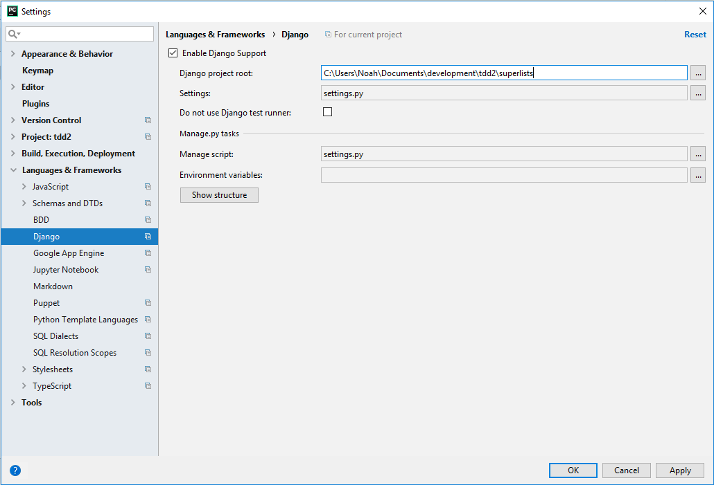
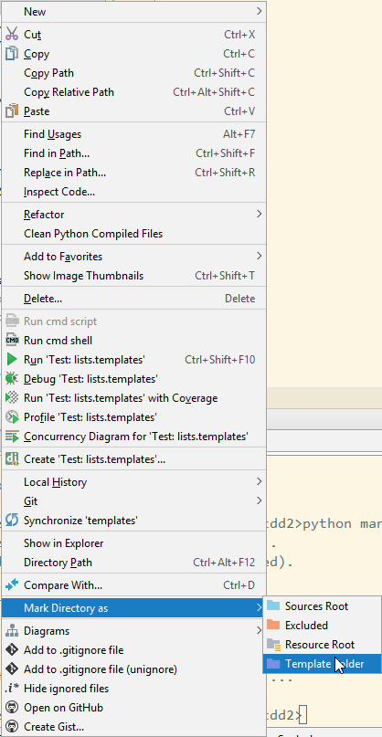

# Test-Driven Python Development

This is the source code from Harry Percival's book [Test-Driven Python Development](https://www.obeythetestinggoat.com/).

## Getting set up

Make sure `Python 3.6.X` is installed.

From the root directory, install the requirements file using `pip install -r requirements.txt`.

Because this project has django-extensions you can run `python manage.py runserver_plus` for extra debugging functionality.

## Chapter Notes

These are caveats I found when getting going through the book. They're mostly notes to myself for future reference.

### Chapter 1

- Make sure to read [the prerequisites](https://www.obeythetestinggoat.com/book/pre-requisite-installations.html) when getting your environement set up.

### Chapter 2

- Functional tests - See the application from the user's perspective and see how it functions. It can be used to track
a user's story  throug the application. These can also be known as acceptance or end-to-end tests.
  - They should always have a followable human-readable story.
  
- Don't make comments that repeat what the code is doing

- Make sure to enable Django support if using Pycharm 

- Tests are organized into classes which inherit from `unittest.TestCase`
  - All methods must start with `test_` and can contain multiple tests
  - Descriptive method names are excellent
  
 - `setUp` and `tearDown` are run after each test
 
 - [Unittest docs](https://docs.python.org/3/library/unittest.html) can be found here.
 
### Chapter 3

- Functional tests - test the application from the user's perspective (high level)

- Unit tests - test the application from the programmer's perspective (low level)

- The TDD approach is usually the following:
  1. Write a functional test
  2. Think, then write unit tests to define how the code should behave (each line of code is covered by at least one test)
  3. Write code to get the unit test to pass (then repeat steps 2 and 3)
  4. Rerun functional tests and continue testing and developing

- **Always review what you commit before you do it**

- Django's workflow is similar to this:
  - HTTP request comes in for a particular URL
  - Django uses rules to find which view function should deal with the request
  - The view processes the request and returns the an HTTP response
  
- Only solve one error at a time, don't try to over engineer solutions

- Resolving errors is usually done in the following order:
  - Look at the error
  - Look at the test that is failing
  - Look at where in the *test* code the failure is coming from
  - Look at the code which is causing the error

### Chapter 4

- Guido explaining the `any()` function [here](https://bit.ly/1iXxD18)

- Don't test constants

- When refactoring, don't change functionality

- You can set specific folders to have a content type like templates
  - This is set my right-clicking on the folder and selecting `Mark directory as`
  - 
  
- You can use `repr(<thing>)` to get the raw value of an item

- The `resolve(<url>)` returns which view function a URL is mapped to

- Most assertX methods can be given a custom error message for more clarity

- An excellent TDD diagram [is here](https://www.obeythetestinggoat.com/book/chapter_philosophy_and_refactoring.html#simple-TDD-diagram)

- Double-loop TDD link [goes here](https://bit.ly/1iXzoLR)

- Source code for the book can be [found here](https://github.com/hjwp/book-example/)

### Chapter 5

- A list of cool books to read can be [found here](https://www.obeythetestinggoat.com/book/bibliography.html#seceng)

- [f-strings](https://docs.python.org/3/whatsnew/3.6.html#pep-498-formatted-string-literals) are amazing

- Red/Green/Refactor
  - Start by writing a unit test (which fails)
  - Write the simplest code to get it to pass, even if it involves cheating (green)
  - Refactor the code to make more sense
  - If cheating is working too well, write another test that breaks the cheating logic

- If you get a `TypeError: 'FirefoxWebElement' object is not iterable`, make sure you're using `elements` instead of `element`.

- Three strikes and refactor (DRY principal)

- Integration test - Tests that rely on external systems (ex: a database)

- `Django.db.utils.OperationalError: no such column` = migrations have not been applied yet

- Each test should only test one item
  - First section is setting up the test
  - Second section calls the code for the test
  - Third section makes the test assertions
  
### Chapter 6

- To test a specific app run `python manage.py test <app>`

- Implicit waits are bad ([see article](https://martinfowler.com/articles/nonDeterminism.html))

- YAGNI = You ain't gonna need it!

- Double hashes (##) are meta-comments that explain how the test is working and why

- A missing URL error might look like `AssertionError: 404 != 200 : Couldn't retrieve content: Response code was 404 (expected 200)`

- Not ending URL with a slash might result in the following error if there's a redirect: `AssertionError: 301 != 200 : Couldn't retrieve content: Response code was 301 (expected 200)`

### Chapter 7

- If a POST action is not specified, it will post to the current page

- URLs without a trailing slash are "action" urls (they modify the database)

- Foreign keys in models must be after the declared model

- It's possible to delete migrations but it should never be done if the migration has been applied. A good rule of thumb is to never delete or modify a migration after it's added to VCS

- `.item_set` is an incredible useful reverse lookup. Can be used as <object>.item_set.all.

### Chapter 8

- If the error `socket.error: [WinError 10054] An existing connection was forcibly closed by the remote host`. Add a `self.browser.refresh()` just before the `self.browser.quit()` in `tearDown` to get rid of them.

- Bootstrap 4 uses `mx-auto` to center items. Use this to get the `test_layout_and_styling` test to pass.

- 
